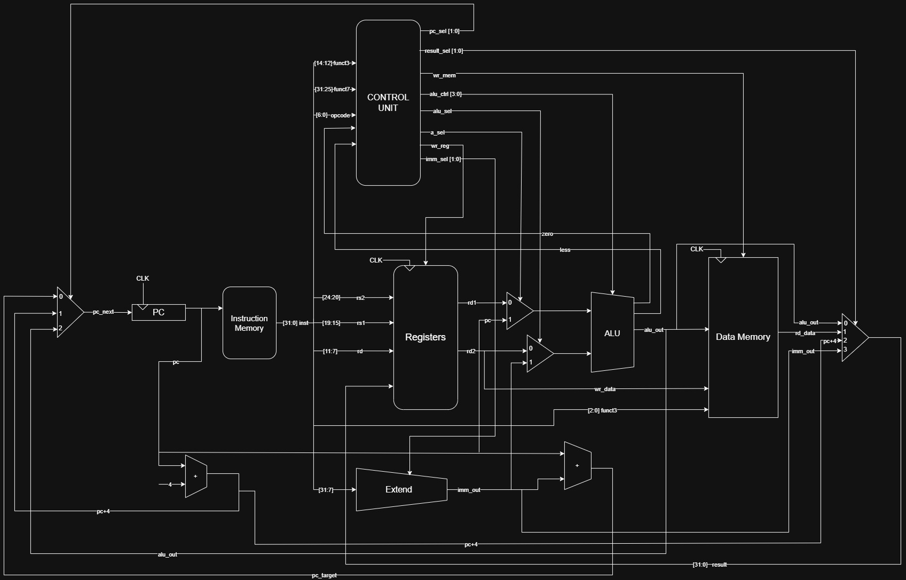
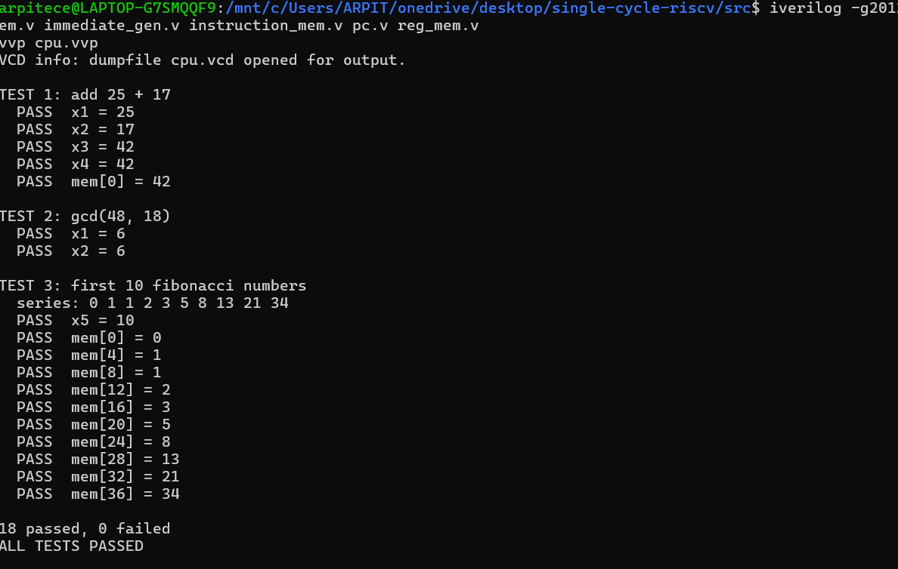
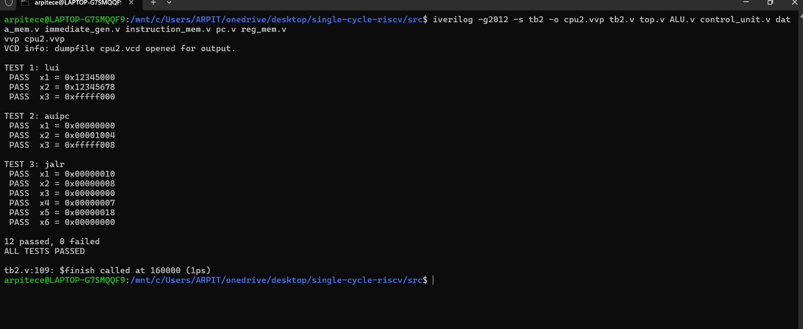

# Single-Cycle RISC-V Processor (RV32I) in Verilog

A single-cycle 32-bit RISC-V processor written in Verilog HDL, with self-checking testbenches that verify arithmetic, memory access, branching and jumps. Simulated and verified with Icarus Verilog.

## Features

- Single-cycle RV32I datapath: every instruction completes in one clock cycle
- 37 base-ISA instructions implemented (see [Supported Instructions](#supported-instructions))
- Separate instruction and data memories
- 32 x 32-bit register file with `x0` hardwired to zero
- Byte-addressable data memory with byte, halfword and word accesses (signed and unsigned loads)
- Modular design: each block is its own module
- Two self-checking testbenches with PASS/FAIL reporting and waveform dumps

## Block Diagram



The control unit decodes `opcode`, `funct3` and `funct7`, and uses the ALU's `zero` and `less` flags to choose the next PC for branches. Two muxes in front of the ALU select its operands (`rd1` or `pc`, and `rd2` or the immediate), and a 4-way mux selects what is written back to the register file.

## Repository Structure

```
.
├── src/
│   ├── top.v              # top-level module
│   ├── pc.v               # program counter
│   ├── instruction_mem.v  # instruction memory (256 x 32-bit)
│   ├── reg_mem.v          # register file (32 x 32-bit)
│   ├── immediate_gen.v    # immediate generator (I/S/B/J/U)
│   ├── control_unit.v     # control logic
│   ├── ALU.v              # arithmetic logic unit
│   ├── data_mem.v         # data memory (1 KB, byte addressable)
│   ├── mux.v              # pc_mux, alu_a_mux, alu_mux, result_mux
│   ├── tb.v               # testbench 1: add, gcd, fibonacci
│   └── tb2.v              # testbench 2: lui, auipc, jalr
├── DOCS/
│   └── risc-v_dark.jpg
├── SIM/
│   ├── sim_tb1.png
│   └── sim_tb2.png
└── README.md
```

## Modules

| Module | File | Description |
|---|---|---|
| `top` | `top.v` | Connects all blocks. Inputs: `clk`, `rst` |
| `pc` | `pc.v` | 32-bit PC with synchronous reset |
| `inst_mem` | `instruction_mem.v` | 256 words, indexed by `pc[9:2]`, combinational read |
| `reg_mem` | `reg_mem.v` | Two combinational read ports, one synchronous write port, writes to `x0` ignored |
| `imm_gen` | `immediate_gen.v` | Builds the sign-extended immediate from `imm_sel` |
| `cu` | `control_unit.v` | Generates all control signals from the instruction fields |
| `alu` | `ALU.v` | 10 operations, plus `zero` and `less` flags for branches |
| `data_mem` | `data_mem.v` | 1 KB byte-addressable memory, `funct3` selects access size |
| `pc_mux` | `mux.v` | Selects next PC: `pc+imm`, `pc+4` or `alu_out` |
| `alu_a_mux` | `mux.v` | ALU input A: `rd1` or `pc` (for AUIPC) |
| `alu_mux` | `mux.v` | ALU input B: `rd2` or immediate |
| `result_mux` | `mux.v` | Write-back: `alu_out`, load data, `pc+4` or immediate |

## Supported Instructions

37 RV32I instructions are implemented.

| Instruction | Type | Opcode | funct3 | funct7 | Operation |
|---|---|---|---|---|---|
| `add` | R | `0110011` | `000` | `0000000` | `rd = rs1 + rs2` |
| `sub` | R | `0110011` | `000` | `0100000` | `rd = rs1 - rs2` |
| `sll` | R | `0110011` | `001` | `0000000` | `rd = rs1 << rs2[4:0]` |
| `slt` | R | `0110011` | `010` | `0000000` | `rd = (rs1 < rs2) ? 1 : 0` (signed) |
| `sltu` | R | `0110011` | `011` | `0000000` | `rd = (rs1 < rs2) ? 1 : 0` (unsigned) |
| `xor` | R | `0110011` | `100` | `0000000` | `rd = rs1 ^ rs2` |
| `srl` | R | `0110011` | `101` | `0000000` | `rd = rs1 >> rs2[4:0]` (logical) |
| `sra` | R | `0110011` | `101` | `0100000` | `rd = rs1 >>> rs2[4:0]` (arithmetic) |
| `or` | R | `0110011` | `110` | `0000000` | `rd = rs1 \| rs2` |
| `and` | R | `0110011` | `111` | `0000000` | `rd = rs1 & rs2` |
| `addi` | I | `0010011` | `000` | - | `rd = rs1 + imm` |
| `slti` | I | `0010011` | `010` | - | `rd = (rs1 < imm) ? 1 : 0` (signed) |
| `sltiu` | I | `0010011` | `011` | - | `rd = (rs1 < imm) ? 1 : 0` (unsigned) |
| `xori` | I | `0010011` | `100` | - | `rd = rs1 ^ imm` |
| `ori` | I | `0010011` | `110` | - | `rd = rs1 \| imm` |
| `andi` | I | `0010011` | `111` | - | `rd = rs1 & imm` |
| `slli` | I | `0010011` | `001` | `0000000` | `rd = rs1 << shamt` |
| `srli` | I | `0010011` | `101` | `0000000` | `rd = rs1 >> shamt` (logical) |
| `srai` | I | `0010011` | `101` | `0100000` | `rd = rs1 >>> shamt` (arithmetic) |
| `lb` | I | `0000011` | `000` | - | `rd = sext(mem8[rs1 + imm])` |
| `lh` | I | `0000011` | `001` | - | `rd = sext(mem16[rs1 + imm])` |
| `lw` | I | `0000011` | `010` | - | `rd = mem32[rs1 + imm]` |
| `lbu` | I | `0000011` | `100` | - | `rd = zext(mem8[rs1 + imm])` |
| `lhu` | I | `0000011` | `101` | - | `rd = zext(mem16[rs1 + imm])` |
| `sb` | S | `0100011` | `000` | - | `mem8[rs1 + imm] = rs2[7:0]` |
| `sh` | S | `0100011` | `001` | - | `mem16[rs1 + imm] = rs2[15:0]` |
| `sw` | S | `0100011` | `010` | - | `mem32[rs1 + imm] = rs2` |
| `beq` | B | `1100011` | `000` | - | `if (rs1 == rs2) pc += imm` |
| `bne` | B | `1100011` | `001` | - | `if (rs1 != rs2) pc += imm` |
| `blt` | B | `1100011` | `100` | - | `if (rs1 < rs2) pc += imm` (signed) |
| `bge` | B | `1100011` | `101` | - | `if (rs1 >= rs2) pc += imm` (signed) |
| `bltu` | B | `1100011` | `110` | - | `if (rs1 < rs2) pc += imm` (unsigned) |
| `bgeu` | B | `1100011` | `111` | - | `if (rs1 >= rs2) pc += imm` (unsigned) |
| `jal` | J | `1101111` | - | - | `rd = pc + 4; pc += imm` |
| `jalr` | I | `1100111` | `000` | - | `rd = pc + 4; pc = rs1 + imm` |
| `lui` | U | `0110111` | - | - | `rd = imm << 12` |
| `auipc` | U | `0010111` | - | - | `rd = pc + (imm << 12)` |

**Not implemented**

| Instruction | Notes |
|---|---|
| `fence`, `ecall`, `ebreak` | Decoded as NOPs (no register or memory write, PC advances by 4) |
| `fence.i` | Not supported |
| `csrrw`, `csrrs`, `csrrc`, `csrrwi`, `csrrsi`, `csrrci` | Not supported, there is no CSR file |

## Control Signals

| Signal | Width | Meaning |
|---|---|---|
| `pc_sel` | 2 | `00` = `pc + imm`, `01` = `pc + 4`, `10` = `alu_out` |
| `imm_sel` | 3 | `000` = I, `001` = S, `010` = B, `011` = J, `100` = U |
| `a_sel` | 1 | `0` = `rd1`, `1` = `pc` |
| `alu_sel` | 1 | `0` = `rd2`, `1` = immediate |
| `alu_ctrl` | 4 | see ALU table below |
| `result_sel` | 2 | `00` = ALU, `01` = memory, `10` = `pc + 4`, `11` = immediate |
| `wr_reg` | 1 | register file write enable |
| `wr_mem` | 1 | data memory write enable |

**ALU operations**

| `alu_ctrl` | Op | `alu_ctrl` | Op |
|---|---|---|---|
| `0000` | ADD | `0101` | SLL |
| `0001` | SUB | `0110` | SRL |
| `0010` | AND | `0111` | SRA |
| `0011` | OR | `1000` | SLT |
| `0100` | XOR | `1001` | SLTU |

**Control values per instruction type**

| Instruction | `imm_sel` | `a_sel` | `alu_sel` | `result_sel` | `wr_reg` | `wr_mem` | `pc_sel` |
|---|---|---|---|---|---|---|---|
| R-type | - | 0 | 0 | 00 | 1 | 0 | 01 |
| I-type ALU | 000 | 0 | 1 | 00 | 1 | 0 | 01 |
| Load | 000 | 0 | 1 | 01 | 1 | 0 | 01 |
| Store | 001 | 0 | 1 | - | 0 | 1 | 01 |
| Branch | 010 | 0 | 0 | - | 0 | 0 | 00 if taken, else 01 |
| `jal` | 011 | - | - | 10 | 1 | 0 | 00 |
| `jalr` | 000 | 0 | 1 | 10 | 1 | 0 | 10 |
| `lui` | 100 | - | - | 11 | 1 | 0 | 01 |
| `auipc` | 100 | 1 | 1 | 00 | 1 | 0 | 01 |

## Getting Started

### Requirements

- [Icarus Verilog](https://steveicarus.github.io/iverilog/) (tested with `-g2012`)
- [GTKWave](https://gtkwave.sourceforge.net/) (optional, for viewing waveforms)

On Ubuntu or WSL:

```bash
sudo apt update && sudo apt install -y iverilog gtkwave
```

### Compile and run

From the `src` folder.

Testbench 1 (add, gcd, fibonacci):

```bash
iverilog -g2012 -s tb -o cpu.vvp tb.v top.v ALU.v control_unit.v data_mem.v immediate_gen.v instruction_mem.v pc.v reg_mem.v
vvp cpu.vvp
```

Testbench 2 (lui, auipc, jalr):

```bash
iverilog -g2012 -s tb_lui_auipc_jalr -o cpu2.vvp tb2.v top.v ALU.v control_unit.v data_mem.v immediate_gen.v instruction_mem.v pc.v reg_mem.v
vvp cpu2.vvp
```

`top.v` already includes `mux.v`, so do not list it on the command line. The `@* is sensitive to all N words in array` warnings from the memory modules are harmless.

### View waveforms

Each testbench writes a `.vcd` file (`cpu.vcd` and `cpu2.vcd`):

```bash
gtkwave cpu.vcd
```

## Verification

Both testbenches are self-checking. For each test they clear the instruction memory, load a program, reset the core, run until the program reaches a halt instruction (`jal x0, 0`, a jump to itself), and compare registers and data memory against expected values. A 2000-cycle timeout catches programs that never finish.

### Testbench 1: `tb.v`

| Test | Program | Checks |
|---|---|---|
| Add | `25 + 17`, store the result with `sw`, read it back with `lw` | `x3 = 42`, `x4 = 42`, `mem[0] = 42` |
| GCD | `gcd(48, 18)` using subtractive Euclid (`beq`, `blt`, `sub`, `jal`) | `x1 = x2 = 6` |
| Fibonacci | First 10 terms stored to data memory and printed | `mem[0..36]` = 0 1 1 2 3 5 8 13 21 34 |



### Testbench 2: `tb2.v`

| Test | Program | Checks |
|---|---|---|
| `lui` | `lui x1, 0x12345`, then `addi` to build `0x12345678`, and `lui x3, 0xfffff` | `x1 = 0x12345000`, `x2 = 0x12345678`, `x3 = 0xfffff000` |
| `auipc` | Three `auipc` instructions at PC = 0, 4 and 8 | `x1 = 0x0`, `x2 = 0x1004`, `x3 = 0xfffff008` |
| `jalr` | Two jumps (offset 0 and offset 12) that each skip an instruction | link addresses `x2 = 8`, `x5 = 24`; skipped instructions leave `x3 = x6 = 0`; `x4 = 7` |



### Coverage

The two testbenches exercise `addi`, `add`, `sub`, `lw`, `sw`, `beq`, `blt`, `jal`, `jalr`, `lui` and `auipc`. Not yet covered by a test: the shifts, `slt`/`sltu` and their immediate forms, `xor`/`or`/`and` and their immediate forms, `bne`, `bge`, `bltu`, `bgeu`, and the byte/halfword loads and stores (`lb`, `lh`, `lbu`, `lhu`, `sb`, `sh`).

## Known Limitations

- `jalr` does not clear bit 0 of the target address, as the spec requires.
- The instruction memory is loaded by the testbench through hierarchical writes; there is no `$readmemh` or program-file loader yet.
- The data memory is not initialized, so reading a location before writing it returns `X`.
- Unknown opcodes and illegal funct fields are not trapped.
- `fence`, `ecall`, `ebreak`, `fence.i` and the CSR instructions are not supported.
- Memory sizes are small: 1 KB of instruction memory and 1 KB of data memory.

## Future Work

- Add the CSR file and system instructions
- Fix the `jalr` target alignment
- Add tests for the remaining instructions
- Load programs from a hex file
- Extend to a 5-stage pipeline with hazard handling

## Tools

- Verilog HDL
- Icarus Verilog and GTKWave
- Developed and tested on WSL (Ubuntu)
